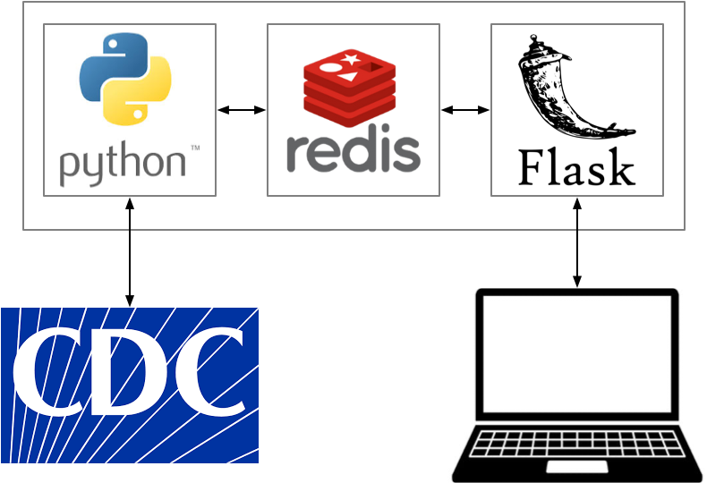

## Overview

The repo contains a simple application with three components:

1. A Python program using [`requests`](https://docs.python-requests.org/en/master/) to collect data.
2. A [Redis](https://redis.io/) database to store data
3. A [Flask](https://flask.palletsprojects.com/en/2.0.x/) server launched via [gunicorn](https://gunicorn.org/) to server up the data.

The data used in this example is the current number of confirmed COVID-19 cases from the [CDC API](https://data.cdc.gov/Case-Surveillance/United-States-COVID-19-Cases-and-Deaths-by-State-o/9mfq-cb36).  

The "application" modeled is intentionally minimal: Every 15 minutes, the collector obtains the current count and stores it in the Redis database.  The Flask server has a single end point that allows a user to fetch this data.

